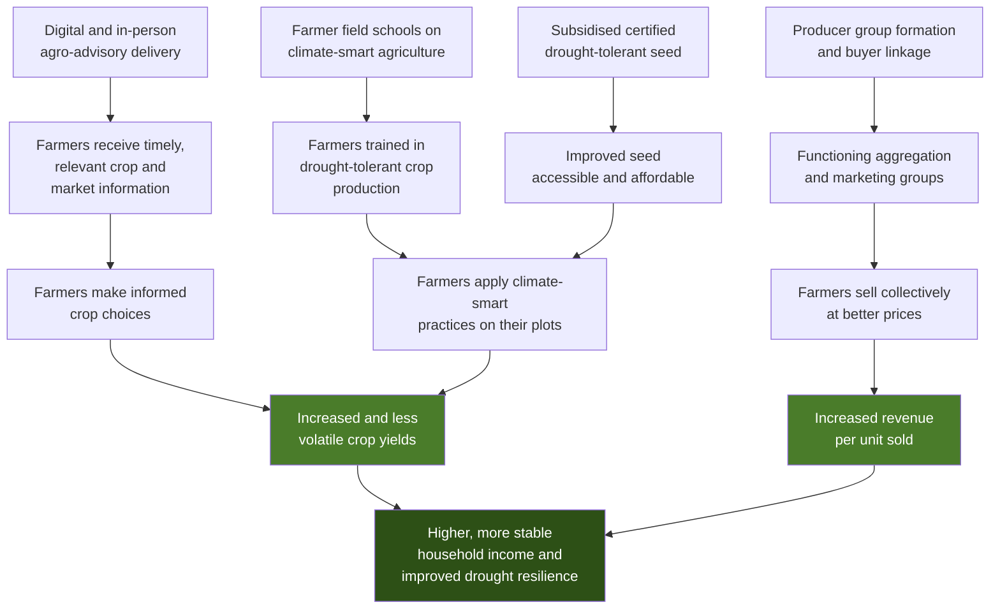

# Measurement System Design
## Kitui Drought Resilience and Smallholder Income Programme (KDRSIP)

**Portfolio piece 1 of 3** — Prepared by Virginia Ngami Paul, M&E Specialist

> **Note on this document.** KDRSIP is a fictional programme created as a professional portfolio exercise. It is not a real project and no real beneficiary data is used. The design follows the conventions of World Bank results frameworks and OECD-DAC evaluation criteria, and is modelled on the kind of drought-resilience and food-systems work implemented in Kenya's arid and semi-arid lands (ASALs). Pieces 2 and 3 build the data pipeline and the learning system for this same programme.

---

## 1. Programme summary

| Field | Detail |
|---|---|
| Programme name | Kitui Drought Resilience and Smallholder Income Programme (KDRSIP) |
| Location | Kitui County, Kenya — Kitui Rural, Mwingi West, Kitui South sub-counties |
| Duration | 48 months (Jan 2026 – Dec 2029) |
| Implementing agency | County Department of Agriculture, with national ministry oversight |
| Target population | 12,000 smallholder farming households (≈70,000 individuals) |
| Targeting criteria | Landholding under 5 acres; primary income from rain-fed agriculture; resident in wards classified as "stressed" or worse under IPC |
| Development objective | To increase and stabilise the agricultural incomes of smallholder households in Kitui County and strengthen their resilience to drought shocks |

**Problem statement.** Smallholder households in Kitui depend on two unreliable rainy seasons. Yields from traditional maize-dominant systems fail in roughly one season in three. Households therefore earn little or nothing from farming, sell productive assets to cope, and lack the information needed to switch to drought-tolerant or higher-value crops with reliable markets. The constraint is not only rainfall. It is also information: farmers do not know which crops have buyers, at what price, or what agronomy those crops require.

---

## 2. Theory of change

### 2.1 Narrative

**If** smallholder households receive timely, locally relevant agro-advisory information through channels they actually use, **and** are supported to adopt drought-tolerant crops and climate-smart practices, **and** are linked to aggregated markets with transparent pricing, **then** their yields will become less volatile and their crop sales revenue will rise, **because** the binding constraints are information asymmetry, practice gaps, and weak market access rather than land or labour scarcity.

**This will only hold if** rainfall does not fail in more than two consecutive seasons, input supply chains remain functional, aggregation groups are not captured by local elites, and women retain decision-making power over the income generated.

### 2.2 Causal logic

### 2.3 Assumptions by level

| Level | Assumption | Risk if it fails | How we monitor it |
|---|---|---|---|
| Activity → Output | Mobile network coverage is adequate in target wards | Digital advisory reaches only a subset; bias toward better-off wards | Ward-level coverage mapping at baseline; delivery-rate monitoring |
| Output → Intermediate result | Farmers trust the advisory source enough to act on it | Training attended but practices not adopted | Adoption survey; trust question in annual survey |
| Output → Intermediate result | Women can attend sessions given care and labour burdens | Female participation nominal; benefits accrue to men | Attendance disaggregated by sex; qualitative follow-up |
| Intermediate result → Outcome | Rainfall is not catastrophically below average for more than two consecutive seasons | Yield gains invisible regardless of practice adoption | Seasonal rainfall data from the Meteorological Department, logged alongside yield data |
| Outcome → Impact | Women retain control over income from crops they produce | Household income rises but women's welfare does not | Intra-household decision-making module in annual survey |

---

## 3. Results framework (logframe)

### Impact

| Statement | Indicator | Baseline | Target (Y4) | Means of verification |
|---|---|---|---|---|
| Smallholder households in Kitui have higher and more stable incomes and are more resilient to drought | Median annual household income from crop sales (KES, real 2026 terms) | 18,400 | 32,000 | Annual household survey |
| | Proportion of households resorting to negative coping strategies during a drought season (reduced Coping Strategies Index) | 62% | 38% | Annual household survey |

### Outcomes

| # | Outcome statement | Indicator | Baseline | Y4 target | MoV |
|---|---|---|---|---|---|
| OC1 | Target households achieve higher and less volatile crop yields | Mean yield of promoted drought-tolerant crops (kg/acre) | 310 | 520 | Annual survey + crop cut sub-sample |
| OC1 | | Coefficient of variation in household crop yield across seasons | 0.71 | 0.45 | Annual survey, panel sub-sample |
| OC2 | Target households capture a greater share of value from what they sell | Mean farm-gate price received as % of county wholesale price | 58% | 75% | Producer group sales records + county price monitor |

### Intermediate results

| # | IR statement | Indicator | Baseline | Y4 target | MoV |
|---|---|---|---|---|---|
| IR1 | Farmers make informed crop and market choices | % of targeted farmers who can correctly identify current season price and at least one buyer for their main crop | 14% | 60% | Annual survey knowledge module |
| IR2 | Farmers apply climate-smart agricultural practices | % of targeted farmers applying at least three promoted CSA practices | 9% | 55% | Annual adoption survey |
| IR3 | Farmers market collectively | % of targeted farmers selling through a producer group in the last 12 months | 6% | 45% | Annual survey + group records |

### Outputs

| # | Output statement | Indicator | Baseline | Y4 target | MoV |
|---|---|---|---|---|---|
| OP1 | Agro-advisory information delivered | Number of farmers reached with agro-advisory information, disaggregated by sex | 0 | 12,000 (min. 50% female) | Delivery platform logs + attendance registers |
| OP2 | Farmers trained through farmer field schools | Number of farmers completing a full FFS cycle, by sex | 0 | 8,400 | Training registers |
| OP3 | Certified drought-tolerant seed distributed | Metric tonnes of certified seed distributed; number of households receiving | 0 | 240 MT / 10,000 HH | Distribution records, e-voucher redemption data |
| OP4 | Producer groups formed and linked to buyers | Number of producer groups with at least one active buyer contract | 0 | 120 | Group registration and contract records |

---

## 4. Indicator reference sheets

Each sheet below follows the Performance Indicator Reference Sheet (PIRS) convention. Full programme documentation would carry one sheet per indicator; three representative sheets are included here — one output, one intermediate result, one outcome.

---

### PIRS 1 — Output level

**Indicator OP1: Number of farmers reached with agro-advisory information, disaggregated by sex**

| Field | Specification |
|---|---|
| **Result level** | Output |
| **Linked result** | OP1 — Agro-advisory information delivered |
| **Definition** | A farmer is counted as "reached" when they have received at least four agro-advisory messages or attended at least one advisory session within the reporting quarter. "Agro-advisory information" means crop-specific agronomic guidance, seasonal weather advisories, or market price and buyer information issued by the programme. |
| **Unit of measure** | Count of individual farmers (unique) |
| **Numerator / denominator** | Not a ratio. Simple count of unique individuals. |
| **Disaggregation** | Sex; age band (18–35 / 36–59 / 60+); sub-county; ward; delivery channel (SMS, IVR, WhatsApp group, in-person session); household headship (female-headed / male-headed) |
| **Data source** | Advisory delivery platform logs (for digital channels); signed attendance registers (for in-person sessions) |
| **Collection method** | Automated export from the delivery platform; manual entry of attendance registers into a KoboToolbox form by the ward extension officer |
| **Frequency** | Monthly collection; quarterly reporting |
| **Responsible** | Ward extension officers collect; sub-county M&E assistant compiles; programme M&E Specialist validates |
| **Baseline** | 0 (Jan 2026) |
| **Targets** | Y1: 3,000 · Y2: 7,000 · Y3: 10,000 · Y4: 12,000 (cumulative unique farmers; minimum 50% female each year) |
| **Rationale for target** | Based on registered farmer lists in the three sub-counties and a realistic extension officer-to-farmer ratio of 1:400 |
| **Analysis and use** | Compared against target quarterly. The sex disaggregation is the operational trigger: if female reach falls below 45% in any quarter, the delivery channel mix is reviewed at the next reflection session. |
| **Known limitations** | Reach is not adoption. A farmer counted as reached may not have read or understood the message. Digital logs record delivery to a handset, not to a person; handset sharing within households means the sex attribution can be wrong. This is mitigated by an annual verification question in the household survey ("who in this household receives the messages?"). |
| **Quality assurance** | Deduplication on national ID hash across channels; monthly reconciliation of platform logs against attendance registers; quarterly spot-check of 5% of registers by phone call-back |
| **Reporting** | Quarterly progress report, indicator tracking table, and county dashboard |

---

### PIRS 2 — Intermediate result level

**Indicator IR2: Percentage of targeted farmers applying at least three promoted climate-smart agricultural practices**

| Field | Specification |
|---|---|
| **Result level** | Intermediate result |
| **Linked result** | IR2 — Farmers apply climate-smart agricultural practices |
| **Definition** | A farmer is counted as "applying" a practice when they report having used it on at least one plot during the most recent completed season **and** the practice is physically verified by the enumerator during the plot walk where verification is possible. The seven promoted practices are: (1) drought-tolerant certified seed, (2) conservation tillage / minimum till, (3) mulching, (4) in-field water harvesting (zai pits or terracing), (5) intercropping with a legume, (6) organic soil amendment, (7) staggered planting to spread rainfall risk. |
| **Unit of measure** | Percentage |
| **Numerator** | Number of surveyed target farmers applying ≥3 of the 7 promoted practices in the most recent completed season |
| **Denominator** | Total number of surveyed target farmers who cultivated in the most recent completed season |
| **Disaggregation** | Sex of respondent; household headship; sub-county; landholding size band (<1, 1–2.5, 2.5–5 acres); years since programme enrolment; individual practice (so the mix, not only the count, is visible) |
| **Data source** | Annual adoption survey, administered to a probability sample of enrolled households |
| **Collection method** | KoboToolbox structured questionnaire on tablets, with GPS capture of the surveyed plot and photo capture for verifiable practices (mulching, zai pits, terracing) |
| **Sampling** | Stratified two-stage cluster sample. Strata: sub-county. Stage 1: wards selected with probability proportional to enrolled households. Stage 2: 12 households per selected ward by systematic random selection from the enrolment register. n = 1,080 for a ±3% margin of error at 95% confidence, design effect 1.8. Panel sub-sample of 400 households retained across years to allow within-household change analysis. |
| **Frequency** | Annual, timed for 6–8 weeks after the long-rains harvest |
| **Responsible** | Programme M&E Specialist designs and analyses; contracted enumerator team collects; county statistician reviews |
| **Baseline** | 9% (Feb 2026 baseline survey) |
| **Targets** | Y1: 20% · Y2: 35% · Y3: 47% · Y4: 55% |
| **Rationale for target** | Adoption literature for CSA packages in East Africa shows plateau effects; a 46-point gain over four years is ambitious but within the range achieved by comparable FFS-based programmes |
| **Analysis and use** | Reported against target annually. Cross-tabulated against FFS completion (OP2) to test whether training is the active ingredient. The per-practice breakdown identifies which practices are being ignored and why, which feeds directly into the following year's FFS curriculum. |
| **Known limitations** | Self-report inflates adoption, particularly where respondents associate the programme with future benefits. Physical verification covers only four of the seven practices. Adoption in a single season is not sustained adoption; the panel sub-sample partially addresses this. The indicator counts practices, not quality of application. |
| **Quality assurance** | 10% of interviews back-checked within 72 hours by a supervisor; GPS and timestamp audit to detect fabricated interviews; enumerator-level outlier analysis on response distributions; double entry not required as data is captured digitally with in-form constraints |
| **Reporting** | Annual report, mid-term review, county dashboard |

---

### PIRS 3 — Outcome level

**Indicator OC1: Median annual household income from crop sales (KES, real 2026 terms)**

| Field | Specification |
|---|---|
| **Result level** | Outcome, contributing to Impact |
| **Linked result** | OC1 / Impact statement |
| **Definition** | Total gross revenue received by the household from the sale of crops over the preceding 12 months, summed across all crops and all sales channels, net of nothing (gross revenue, not profit). Deflated to 2026 prices using the KNBS rural CPI. Own-consumption is excluded and tracked as a separate indicator. |
| **Unit of measure** | Kenyan Shillings (median, not mean) |
| **Numerator / denominator** | Not a ratio. Median of the household-level distribution. |
| **Why median** | Crop income distributions in ASAL smallholder populations are strongly right-skewed. A small number of households with irrigated plots or livestock trading income distort the mean. The median is reported as the headline; the mean, the interquartile range and the 10th/90th percentiles are reported alongside it. |
| **Disaggregation** | Household headship; sub-county; landholding size band; whether the household sold through a producer group; primary crop |
| **Data source** | Annual household survey (same instrument and sample as IR2) |
| **Collection method** | KoboToolbox module using a crop-by-crop recall grid: for each crop cultivated, quantity harvested, quantity sold, unit, price received, buyer type, month of sale. Revenue is computed, not asked directly, because direct recall of annual totals is unreliable. |
| **Frequency** | Annual |
| **Responsible** | Programme M&E Specialist; analysis reviewed by an independent statistician before publication |
| **Baseline** | KES 18,400 (Feb 2026) |
| **Targets** | Y1: 20,000 · Y2: 24,000 · Y3: 28,500 · Y4: 32,000 |
| **Rationale for target** | Derived from modelled yield gains on the promoted crop mix at conservative price assumptions, discounted by an expected 35% attribution loss to non-programme factors |
| **Attribution** | This indicator cannot be attributed to the programme by monitoring alone. Attribution is addressed at midline and endline through a difference-in-differences comparison against matched households in three non-programme wards, established at baseline. Routine reporting states change, not impact. |
| **Analysis and use** | Reported annually with confidence intervals. Seasonal rainfall data is presented alongside the figure in every report so that variance is read in context. Falling short of target in a poor rainfall year is a different finding from falling short in a good one, and the report must make that distinction explicit rather than leave it to the reader. |
| **Known limitations** | Twelve-month recall of prices and quantities is subject to telescoping and rounding to salient figures. Unit conversions (gorogoro, debe, 90kg bag) vary by market and are a known source of error; a standardised conversion table is embedded in the form. Households under-report income where they suspect a link to taxation or targeting. Gross revenue says nothing about profitability, since input costs are rising over the same period; a parallel input-cost module is collected for this reason. |
| **Quality assurance** | In-form range constraints flag implausible yields and prices at the point of entry; conversion table applied in-form rather than post-hoc; 10% supervisor back-check; independent review of the cleaning and analysis script before results are published |
| **Reporting** | Annual report, mid-term review, endline evaluation, World Bank results framework submission |

---

## 5. Data quality assurance plan

### 5.1 The five dimensions

Data quality is assessed against five standard dimensions. Every indicator in this framework must be able to satisfy all five on demand.

| Dimension | Question it answers | How KDRSIP satisfies it |
|---|---|---|
| **Validity** | Does the indicator actually measure the result it claims to measure? | Each PIRS states the definition, the known limitations, and where attribution stops. Proxy indicators are labelled as proxies. |
| **Reliability** | Would the same measurement, repeated, produce the same result? | Standardised instruments, enumerator training and certification before each round, identical question wording across years, documented conversion tables. |
| **Timeliness** | Is the data available when the decision needs to be made? | Collection calendar is set backwards from the quarterly reflection session and the donor reporting deadline, not forwards from convenience. |
| **Precision** | Is the margin of error small enough for the use? | Sample sizes are calculated for a ±3% margin at 95% confidence with a design effect of 1.8. Confidence intervals are reported, never point estimates alone. |
| **Integrity** | Is the data free from manipulation, deliberate or otherwise? | Separation of collection from verification; GPS and timestamp audit; back-checks conducted by staff who did not collect the original; no performance incentives tied to reported indicator values. |

### 5.2 Routine verification checklist

To be completed by the M&E Specialist each quarter for every indicator reported.

- [ ] Is there a written, current PIRS for this indicator?
- [ ] Can the reported number be traced back to source records within 15 minutes?
- [ ] Does the source record total match the reported total exactly? If not, is the discrepancy documented and explained?
- [ ] Has the reporting period been correctly applied (no double-counting across quarters, no carry-over)?
- [ ] Has deduplication been run, and on what key?
- [ ] Are all required disaggregations present and summing to the total?
- [ ] Were back-checks completed at the required rate, and were discrepancies resolved?
- [ ] Is the cleaning script version-controlled, and does re-running it on the raw file reproduce the reported figure?
- [ ] Have missing values been handled by the documented rule, not ad hoc?
- [ ] Has anyone other than the person who produced the number reviewed it before submission?

### 5.3 Missing data rules

Documented in advance so that handling is not decided case by case under reporting pressure.

| Situation | Rule |
|---|---|
| Household not reached in a survey round | Recorded as non-response with a coded reason. Not imputed. Response rate reported alongside every result. |
| Single item missing within a completed interview | Item reported as missing. Denominators adjusted and stated. No mean substitution for income or yield variables. |
| Whole ward not covered due to access or insecurity | Result reported with an explicit coverage statement. Weights recalculated. Never presented as a full-coverage figure. |
| Implausible value flagged by constraint and not resolvable | Set to missing, logged in the cleaning log with the original value retained in the raw file. |

### 5.4 Ethics and data protection

The programme processes personal data of identifiable individuals and is subject to the **Kenya Data Protection Act, 2019**.

- Informed consent is obtained and recorded at the start of every interview, including explicit consent for GPS and photo capture, which may be declined without affecting programme participation.
- Personal identifiers are stored separately from analysis datasets. Analysis files carry a pseudonymous household ID only.
- The national ID number is never stored in plain text; a salted hash is used as the deduplication key.
- Data is retained for the programme duration plus five years, then destroyed.
- GPS coordinates are rounded in any dataset that is published or shared externally.
- Enumerators sign a confidentiality undertaking and are trained on do-no-harm and safeguarding referral pathways before deployment.

---

## 6. How this framework will be used

A results framework that is only used for reporting is a compliance artefact. This one is designed to feed decisions:

- **Quarterly**, output indicators and the sex-disaggregated reach figure go to a reflection session where delivery is adjusted.
- **Annually**, outcome and intermediate result indicators are read against the assumptions in section 2.3. Where an assumption has failed, the theory of change is revised rather than the target quietly restated.
- **At midline**, the framework itself is reviewed. Indicators that have proved unmeasurable or uninformative are replaced, with the change documented and agreed with the funder rather than made silently.

The mechanics of that learning cycle are set out in portfolio piece 3.

---

*Prepared as a professional portfolio exercise. All figures are illustrative.*
